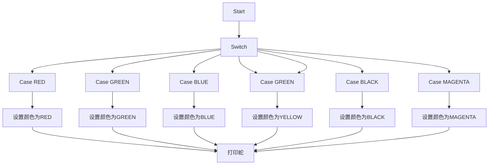

```mermaid
graph TB
A[Start] --> B[Switch]
B --> C[Case RED]
B --> D[Case GREEN]
B --> E[Case BLUE]
B --> F[Case YELLOW]
B --> F[Case GREEN]
B --> G[Case BLACK]
B --> H[Case MAGENTA]
C --> I[设置颜色为RED]
D --> J[设置颜色为GREEN]
E --> K[设置颜色为BLUE]
F --> L[设置颜色为YELLOW]
G --> M[设置颜色为BLACK]
H --> N[设置颜色为MAGENTA]
I --> O[打印蛇]
J --> O
K --> O
L --> O
M --> O
N --> O
```

